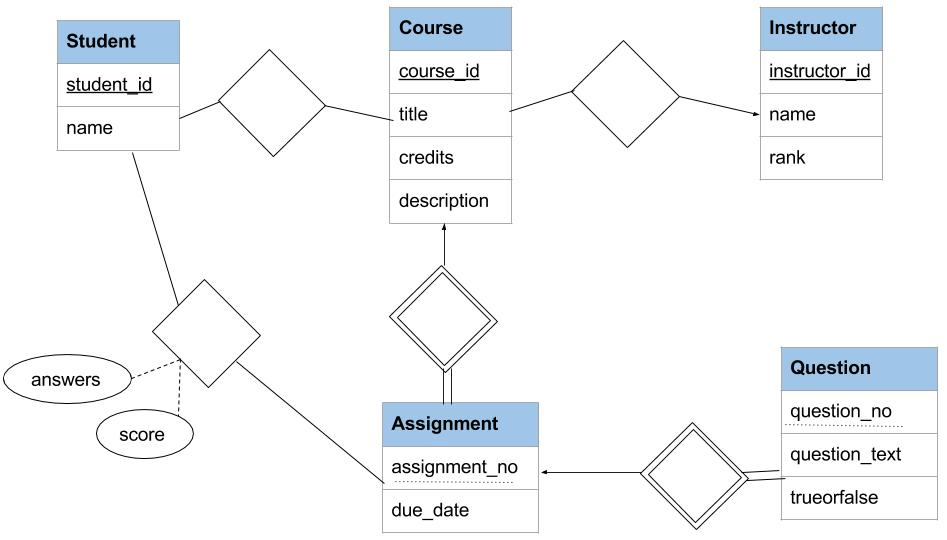

## Project 2: Web Development with Python Django, CMSC424, Fall 2016

**This assignment is to be done by yourself, but you are welcome to discuss the assignment with others.**

The goal of this project is to learn how Web Application Frameworks like Python Django (similar to Ruby-on-Rails) work, and
how they interact with the underlying data store. We will be providing you with a skeleton code, and 
describe a set of files that you need to modify. There are several final deliverables for the assignment:

* You have to complete a few files as described below. In the past, students had most trouble with getting things to work, so we have provided skeleton code where all the links etc., work, except that they don't do anything in some cases. You have to implement that functionality by modifying the specified files. In all cases, there is at least one other similar file that you can use as template. The deliverable here is the modified files. **[16/40 pts]**
* We have also provided the Entity-Relationship Diagram corresponding to the implemented functionality, which is quite minimal. You have to extend the E/R diagram so that it can support additional functionality. The deliverable here is the E/R diagram itself. **[12/40 pts]**
* You have to convert the E/R diagram to a relational schema, and write out the `models.py` file for your E/R diagram. You don't need to make it work, just write out the code. Both the reltional schem and the modified `models.py` file should be submitted. **[12/40 pts]**

Submit all the files (E/R diagram as a PDF, the relational schema in a text file, and the modified python files) as a single zip archive.

### Getting Started
As before, we have provided with a VagrantFile, that installs Django and sets up a few port forwards. 
After logging into the virtual machine with `vagrant ssh`, go to: `/vagrant/gradingsite/` and do `python manage.py runserver 0.0.0.0:8888`.

This starts a webserver at port 8888, using our application code and data (that is already loaded). Go to: `http://localhost:8888/grading/` for 
the main index page of the web application. See below for more details on the application.

### Introduction to Django
You should walk through the excellent Django tutorial: [Django Tutorial](https://docs.djangoproject.com/en/1.10/intro/tutorial01/) -- we don't cover all of that in the description below since the tutorial does a great job at that. Django is quite popular, and there
are quite a few other resources online as well. If you run into an error, searching for the error on Google should lead to some solutions (often on stackoverflow).

The initial web app that we have created is present in `gradingsite/grading` subdirectory (in `/vagrant` on your VM, and `project2` in your host machine).
See below for more details about that app.

Django is a high-level Python Web framework for simplifying creation of complex, database-driven websites. It follows the so-called MVT (Model-View-Template) framework, which is mostly the same as the MVC (Model-View-Controller) framework (used by Ruby Rails framework). These frameworks are usually built around an Object-Relational Mapping (ORM), where the models (defined as Python classes in Django) are transparently mapped to Relations in a backend relational database. 

At a high level, the following things need to be done in order to set up a minimal web application using Django.
* We need to create a set of `models`, which roughly correspond to `entities` in E/R Modeling, and relations in relational databases. In Python code, the models serve as classes of objects, whereas the Django framework takes care of saving any such objects to the database etc. The models are defined in the file `grading/models.py`. You can see the definitions of the models discussed below.
* We need to provide a mapping between URLs and `views`, so that when the web server sees a specific URL, it knows what function to call. See `grading/urls.py` file for these mappings. As an example, the URL `http://localhost:8888/grading/instructor/1` will result in a call to `instructorindex` in `views.py`.
* In each of the `views`, we need to collect the appropriate data, and call a `template`. The `instructorindex` view simply finds the Instructor and calls the template `instructorindex`.
* Templates tell the framework what HTML webpages to construct and return to the web browser. Our templates are in `grading/templates/grading` directory (the tutorial discusses why this specific directory). The `instructorindex.html` template file has a mix of python commands and HTML, and it creates an HTML page after executing of the Python commands. The resulting HTML is what is returned and displayed on the browser when you call: `http://localhost:8888/grading/instructor/1`

The file `django-steps.md` contains a summary of the steps to reconstruct the `polls` app (i.e., a summary of the important steps from the above tutorial). 

**python manage.py shell**: This is an important command that allows you to manipulate the data in the database directly (outside of the web application). The file `populate.py` contains the commands used to construct the data in the provided database.

**Database Backend**: Django can work with many database engines, including PostgreSQL (which is recommended for any serious development). Here we are using the `sqlite3` engine, primarily so we can easily provide you with the database (in the `gradingsite/db.sqlite3` file).

**Admin Website**: If you go to `http://localhost:8888/admin` with username `vagrant` and password `vagrant1`, you can directly manipulate the objects.

### Application Scenario and the Initial E/R Model
The goal of the web application development project is to build an end-to-end application that has a web frontend, and a database backend.  The application scenario is that of handling homework assignments/quizzes for courses (somewhat similar to the ELMS functionality). Although there are quite a few tools out there for this purpose today, we picked this scenario given you are well-familiar with the setting.

As mentioned above, the coding part of this project focuses on a simple set of entities and relationships, as shown in the E/R diagram here. 

The entities here are:
- **Students** who are taking the course. A student may take multiple courses that are being administered by the system. 
- **Instructors**. As above, an instructor may teach multiple courses, but each course only has one instructor (the relationship is many-to-one).
- **Courses:**  Standard information about courses (title, description, instructor) is maintained.
- **Assignments:** A course will have many different assignments, each consisting of several questions. Assignments have due dates. Note that Assignment is a `weak entity` with `assignment_no` being the discrimator. However, Django will assign an ID to the assignment relation, which will become its primary key.
- **Questions:** We only have true/false questions in this initial application.

There are two important relationships here:
- **StudentCourse**: which records which student is taking which course.
- **StudentAssignment**: This relationship connects a student with an assignment that they submitted. So there will only be an entry here for a student after she has completed the assignment. To simplify things, we will record the student answer as a `string`, which we have to encode/decode. The benefit is a simpler E/R diagram and initial set of models. This is **NOT** a good way to do things, and below we ask you to redesign the E/R model to fix this.

If you open the database using `sqlite3 gradingsite/db.sqlite3`, you can directly see the tables being created. The command `.schema` will show you all the tables that have been created (there are quite a few -- focus on the ones like `grading_instructor`).

The provided application has seven types of URLs/views/webpages: 
- **mainindex**: Main "index" page, where we simply display a list of instructors. (example: http://localhost:8888/grading)
- **instructorindex**: Instructor "index" page, which shows the list of courses for the instructor. (example: http://localhost:8888/grading/instructor/1)
- **instructorcourse**: Instructor "course" page - shows a list of assignments for the course, separated by "due date passed" and "active". (example: http://localhost:8888/grading/instructor/1/course/1)
- **instructorassignment**: Instructor "assignment" page - if the assignment is "active": we have a list of submissions but no way to grade them; for "due date passed" assignments, this page will instead show a list of submissions, first yet-to-be-graded assignments, then already-graded. For any of the submitted assignments for the latter, the submission link is clickable. (example: http://localhost:8888/grading/instructor/2/course/1/assignment/1)
- **instructorgradesubmission**: Instructor "submission" page - for a "due date passed" submission, show the student answers, and accept a single overall score from the instructor. (example: http://localhost:8888/grading/instructor2/course/1/assignment/1/student/1)
- **studentindex**: Student "index" page - displays the assignments that are due but not yet submitted, separately from assignments that have been submitted along with their grades ("not graded" otherwise) (example: http://localhost:8888/grading/student/1)
- **studentassignment**: Student "assignment" page - displays the questions in the assignment, allows choosing the answers, and submitting. Every question must be answered. (example: http://localhost:8888/grading/student/1/assignment/2)

*Typically you would want to do some authorizations to separate out the different functionality. This is easy to add by having users, and using `sessions`. We will not worry about it for now. Our focus is on designing the E/R model and the schema, and understanding how to use Django.*

### Assignment Part 1: Files to be Modified

All your modifications will be to the `views.py` file or to one of the template files in `grading/templates/grading`. Specifically, the following pieces need to be fixed. First 6 are 2 pts each, the last one is 4 pts.

1. Complete the template file: `instructorindex.html`, which simply lists all the courses for that instructor. See the `studentindex.html` and `index.html` for similar code.
1. Going to: http://localhost:8888/grading/instructor/10 will raise an ugly error. Use `get_object_or_404` in `instructorindex` view (in `views.py`) to get a better error message.
1. Modify the template file `studentindex.html` -- (1) for all submissions past their due date, show the scores (if they have already been graded). (2) split the "Available" assignments into: "Available, Not Submitted", and "Available, Submitted" -- currently, when you press "Submit Assignment", it simply goes back to this page and having this split will provide the required feedback.
1. Modify the template file `instructorindex.html` to show, along with the list of courses for the instructor, a summary of how many submissions are ready to grade across all assignments for each course.
1. Write the views `instructorassignment` and `instructorgradesubmission` in the `views.py` file. See the `urls.py` file and the above description for what those views should do.
1. Complete the template file `instructorassignment.html` which shows the submission information for a given assignment. 
	* For the "past due date" assignments, it should show a list of all the students for that course sorted by name. If the student has made a submission, there should be a link that allows grading of that submission (i.e., that goes to `instructorgradesubmission` view).
	* For "past due date" assignments, the students who haven't made a submission should be listed, but there should be no link and it should say: no submission.
	* If the assignment is "active", two lists should be shown, first of students with no submissions and the second of students with submissions (but no links to grade submissions in either case).
1. Complete the template file: `instructorgradesubmission.html` where an instructor can enter a score for a submission. The webpage should show the questions in the assignment and the answers for each question next to it (note that, the student answer is recorded as a single string, and needs to be split up). See how the student assignment submission is handled.

**Important Note**: You may have to modify views.py file for some of the modifications to the templates files above.

### Assignment Part 2: Extend E/R Model

Our E/R model is pretty simplistic. You need to modify it so it allows representing the following types of information.
- Fix the E/R model above so that the student answers are properly recorded in a normalized fashion, with answers to different questions separated out. 
- Related to that: an instructor should be able to grade each question separately (i.e., enter a score for each question of a student submission and have it recorded in the database).
- Additional types of questions, including multiple-choice questions, essay questions, and fill-in-the-blank questions. See [Google forms options](https://support.google.com/docs/bin/answer.py?hl=en&answer=140941&topic=20322&ctx=topic) for some ideas.
- A course should be able to have multiple instructors. 
- Allow the course to have multiple sections. The assignments will be linked to the course (i.e., they will be common to all sections), but the instructors for different sections may or may not be different. Students will be enrolled in specific sections, rather than in courses.
- Enable keeping track of all submissions made by a student for an assignment.
- An instructor should be able to set different deadlines for different students (currently the due date for an assignment is the same for all students)

Here is a link to the [Google Drawing of the E/R Diagram](https://docs.google.com/drawings/d/15iaW_iFGaLwm4R4J_dss1soTbLys48GgfWWhO_K6uf4/edit?usp=sharing) above. You are welcome to copy it and modify it. Submit the final E/R diagram as a PDF file.

### Assignment Part 3: `models.py` for your E/R Model

Modify the `models.py` file according to your new E/R models. You are welcome to try to make it work with the rest of the app, but we only need the models.py file, and the grading will be by inspection, not by running it.

