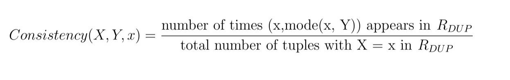

## Project 4: Functional Dependency, CMSC424, Spring 2018

*The assignment is to be done by yourself.*

Please do a `git pull` to download the directory `project4`. 

### Getting started
Start the VM with `vagrant up` in the `project4/` directory.


**Q1 (15pt).** [Functional Dependency] According to your book `X -> Y` (X functionally determines Y) if each value in X is associated precisely with only one value in Y. Your book allows multiple attributes of a relation to combine to form X and/or Y. However, for this project will only consider functional dependencies for which X and Y can correspond to only one attribute from a given relation.   


Consider the following relation *S* having two attributes X and Y. 

**Relation S**

| X | Y |
|:---:|:---:| 
| 1 | 2 | 
| 2 | 3 | 
| 2 | 3 |
| 3 | 3 |
| 4 | 18|
| 7 | 16|

From *S*, we observe that X->Y. However, *Y->X does not hold*. This is because 3 in Y has two possible values of 2 and 3 in X. 

There are two primary ways to determine the functional dependencies that exist for a database schema. One option is ask a domain expert (someone who knows the real-world domain that is being modeled by the database schema) to list them all. Unfortunately, many domain experts charge huge sums of money for their time, and other domain experts are lazy. A viable alternative is to sample existing data and try to algorithmically detect functional dependencies. (Even if you choose this approach, it is still a good idea to verify the output of the algorithm with a domain expert because of the difference between an FD holding on an "instance" of a relation vs. holding on all legal relations, as we dicussed in class). We will get some experience with this alternative approach in this assignment. 

As an additional complication, many real world datasets are collected through a human manually typing the data. Such datasets are prone to some amount of dirtiness in the data. For example, even though name is usually dependent on social security number or some other ID value, in some cases a name is mistyped, and will appear in a dataset alongside other instances of the ID-name pair with the name typed correctly. Take, for example, the following dataset, containing the list of MLB players who hit a home run each day:

| Date | PlayerID | PlayerName | Distance (feet)
|:---:|:---:|:---:|:---:| 
| May 1 | 46 | Yonder Alonso | 420 | 
| May 1 | 24 | Ian Happ | 425 |  
| May 2 | 46 | Yondr Alonso | 455 | 
| May 2 | 97 | Maikel Franco | 397 | 
| May 3 | 46 | Yonder Alonso | 402 | 
| May 4 | 46 | Yonder Alonso | 418 | 

Any human who sees this data set would immediately conclude that PlayerID --> PlayerName is real functional dependency, and that the third tuple, which violates the dependency is simply a typo and not an indication that the dependency doesn't exist. Datasets that are scraped from NoSQL database systems are particularly prone to this type of dirtiness. There has been several research groups (including Prof. Abadi's research group) that have attempted to detect such functional dependencies that seem to exist in a dataset, despite the potential presence of some amount of dirtiness. We will call such detected functional dependencies **fuzzy functional dependencies**. 

Consider the following relation *R* having two attributes X and Y. Let us define R(X) and R(Y) as the domain (the set of all unique values) of attribute X and Y of relation R respectively. 

**Relation R**

| X | Y |
|:---:|:---:| 
| 1 | 2 | 
| 1 | 3 | 
| 1 | 4 |
| 2 | 3 |
| 2 | 3 |
| 2 | 4 |
| 3 | 3 |
| 3 | 3 |
| 4 | 18|
| 7 | 16|


We want to check if X and Y have a fuzzy functional dependency between each other (Y is fuzzy functionally dependent on X, which we will notate as: X~->Y). 

Further, let us define R<sub>DUP</sub>, while considering X~->Y, as the relation obtained from R which removes all tuples for which the value of the X attribute only appears once across the entire dataset. Therefore, in R<sub>DUP</sub>, for each value x of R<sub>DUP</sub>(X):
	
1. x appears multiple times with the same value y from R<sub>DUP</sub>(Y): e.g. x=3 (3,3),(3,3)
2. x appears multiple times with different y values from R<sub>DUP</sub>(Y) : e.g. x=1 (1,2),(1,3),(1,4), x=2 (2,3),(2,3),(2,4)


For the above shown relation R, the corresponding R<sub>DUP</sub> will be as follows:

**Relation R<sub>DUP</sub>**

| X | Y |
|:---:|:---:| 
| 1 | 2 | 
| 1 | 3 | 
| 1 | 4 |
| 2 | 3 |
| 2 | 3 |
| 2 | 4 |
| 3 | 3 |
| 3 | 3 |

Observe that the singleton values from R(X) do not show up in R<sub>DUP</sub>.

Let us define Cardinality(X, Y, x) *for each distinct* value x of R(X) as follows,

<!---
 
--->


For Relation *R*, Cardinality(X, Y, 1) = ⅓ [Presence of (1,2), (1,3), (1,4)], Cardinality(X, Y, 2) = ½ [Presence of (2,3), (2,4)] and Cardinality(X, Y, 7) = 1 [Presence of (7,16)]. We consider only distinct values of Y when defining Cardinality. Thus, Cardinality(X, Y, 3) = 1 [Presence of (3, 3)]. **Note that cardinality is defined on the original relation R, not R<sub>DUP</sub>**. 

Let us define Consistency(X, Y, x) *for each distinct* value x of R<sub>DUP</sub>(x) as follows:

Let mode(x, Y) be the most frequent value of attribute Y that exists in the dataset when X = x, 

<!---

--->



For Relation *R<sub>DUP</sub>*, Consistency(X, Y, 1)=⅓ [1 occurs once each with 2, 3 and 4],  Consistency(2) = ⅔ [2 occurs once with 4 and 2 times with 3] and Consistency(3) = 2/2 [3 occurs with 3 twice]. **Note that consistency is defined on the duplicate relation R<sub>DUP</sub> and not R**.

Using the above definitions, we compute Confidence(X,Y) as follows,          

<!---

--->


We say *X has a fuzzy functional dependency on Y iff* 

<!---

--->


We set the threshold based on the application requirement.

##### Illustrating Confidence Computation

Let us consider the earlier populated tables R and R<sub>DUP</sub> to demonstrate how confidence is computed. We use R to compute **cardinality** as follows:

Cardinality(X, Y, 1) = 1/3, Cardinality(X, Y, 2) = 1/2, Cardinality(X, Y, 3) = 1, Cardinality(X, Y, 4) = 1, Cardinality(X, Y, 7) = 1

Sum of cardinality values = (1/3+1/2+1+1+1) <br/>
Number of unique values in R(X) = 5

Further, we use R<sub>DUP</sub> to compute **consistency** as follows: 

Consistency(X, Y, 1)=1/3, Consistency(X, Y, 2) = 2/3, Consistency(X, Y, 3) = 2/2 

Sum of consistency values = (1/3+2/3+1) <br/>
Number of unique values in R<sub>DUP</sub>(X) = 3
 
Confidence = (1/3+1/2+1+1+1)/5 + [1+(1/3+2/3+1)]/[1+3] = 0.766 + 0.75 = 1.516

#### Coding Details:

For this problem, we have provided you with the following files:

1. **functionaldependncy/FDFinder.java**: Computes and prints all the pairs that have a fuzzy functional dependency on each other using jdbc.
2. **populate-fd.sql**: Loads `functionaldependency/data.csv` into `fddb` database. 

Note that `fddb` is already populated with the dataset. You can check it using: 

```
$ psql fddb
fddb=# select * from dataset;
```

#### Task:

**Fuzzy Functional Dependency**: The Java code iterates through every possible pairs of columns in a dataset and then calls a SQL query over JDBC to calculate the confidence of a fuzzy functional dependency between those two columns. You have to write this SQL query (it will likely be a complicated query with several components in the with clause). See the doQuery method in FDFinder.java and the context for how it is called in order to understand the nature of the SQL query that is sent to the database.

Hint: You many need to cast integers as floats in order to complete your query. In Postgres, there are multiple ways to do this. One is to add ::float at the end. E.g. 1 is an integer, but 1::float is a float.

In order to compile and run your implementation, run the following commands (from the /vagrant directory; not /vagrant/functionaldependency or anywhere else --- **otherwise you will get errors**),

```
$ javac -cp functionaldependency/postgresql-42.2.2.jre7.jar:. functionaldependency/FDFinder.java 
$ java -cp functionaldependency/postgresql-42.2.2.jre7.jar:. functionaldependency/FDFinder
```


#### Coding Restrictions:
1. Please do not modify anything in the code aside from the SQL query.

#### Testing your implementation:

We have provided you with 2 additional files for testing your implementation. 

 1. `answers.txt` : It contains the expected output on running FDFinder.java.
 2. `FDTest.py` : It matches your output on running FDFinder.java against answers.txt that we provide. 

To test your implementation, execute the following commands from 
/vagrant not anywhere else. Firstly, redirect the output of FDFinder.java to a text file (e.g. out.txt) as follows: 
 
 ```
 $ java -cp functionaldependency/postgresql-42.2.2.jre7.jar:. functionaldependency/FDFinder > out.txt
 ```
 Run FDTest.py to compare out.txt and answers.txt. You can do this by running
 
 ```
 $ python FDTest.py answers.txt out.txt
 ```
 
 Please do not modify anything in FDFinder.java aside from the SQL query else you will get errors. 

#### Answer the following questions on ELMS
			 
Based on your experience with calculating fuzzy functional dependency confidence as part of this assignment, please answer the following questions via the Quiz on ELMS that corresponds to this project: 

1. A high cardinality score is assigned to ‘x’ in X if it occurs with many different ‘y’ values in Y. (True or False)

2. A high cardinality score is assigned to ‘x’ in X if it occurs with exactly one ‘y’ value multiple times. (True or False)

3. A high consistency score is assigned to ‘x’ in X if it occurs mostly with a fixed ‘y1’ in Y and with possibly few other values in Y. (True or False)

4. It is impossible for cardinality(X,Y,x) to be 1 and consistency(X,Y,x) to not be 1. (True or False)

5. It is impossible for consistency(X,Y,x) to be 1 and cardinality(X,Y,x) to not be 1. (True or false)

6. How high does the threshold have to be for the fuzzy functional dependency calculation to be the same as a regular functional dependency? (Fill in the blank)

7. The confidence equation adds together two parts --- one part is focused on cardinality and the other part focused on consistency. Do we really need both parts? Let’s say that we removed the **consistency** part, and doubled the **cardinality** part. Under what situations would we be likely to incorrectly identify fuzzy functional dependencies X~->Y when in fact X and Y have nothing to do with each other. (But if we used the original confidence equation, we would likely correctly not identify X~->Y as a fuzzy functional dependency.) Assume reasonable thresholds and data sizes (e.g., a threshold in the range of 1.5-1.7 and 10000-100000 tuples).
	
	(check all that apply)

	X is:
		
	* Mostly unique (only a few repeats).
	* 	Medium number of unique values, with each value repeating approximately the same number of times.
	*  	Few number of unique values, and heavily skewed (99% of column has only one value).
	*   Non-integer values.
	* Doesn’t matter! Only Y matters.
	* Doesn’t matter! We don’t need the consistency part of the equation!

	And Y is:
	
	* Mostly unique (only a few repeats)
	* Medium number of unique values, with each value repeating approximately the same number of times
	* Few number of unique values, and heavily skewed (99% of column has only one value)
	* Non-integer values
	* Doesn’t matter! Only X matters.
	* Doesn’t matter! We don’t need the consistency part of the equation!


8. The confidence equation includes two parts --- one part is focused on cardinality and the other part focused on consistency. Do we really need both parts? Let’s say that we removed the **cardinality** part, and doubled the **consistency** part. Under what situations would we be likely to incorrectly identify fuzzy functional dependencies X~->Y when in fact X and Y have nothing to do with each other. (But if we used the original confidence equation, we would likely correctly not identify X~->Y as a fuzzy functional dependency.) Assume reasonable thresholds and data sizes (e.g., a threshold in the range of 1.5-1.7 and 10000-100000 tuples).

	(check all that apply)

	X is:
	
	* Mostly unique (only a few repeats).
	* Medium number of unique values, with each value repeating approximately the same number of times.
	* Few number of unique values, and heavily skewed (99% of column has only one value).
	* Non-integer values.
	* Doesn’t matter! Only Y matters.
	* Doesn’t matter! We don’t need the consistency part of the equation!

	And Y is:
	
	* Mostly unique (only a few repeats).
	* Medium number of unique values, with each value repeating approximately the same number of times.
	* Few number of unique values, and heavily skewed (99% of column has only one value).
	* Non-integer values.
	* Doesn’t matter! Only X matters.
	* Doesn’t matter! We don’t need the consistency part of the equation!

9. Give an example of a dataset where the full confidence equation (with both parts) still incorrectly predicts a functional dependency that doesn’t really exist (X and Y have nothing to do with each other). Don’t give the actual dataset, just describe X and Y using similar types of descriptions as the options given above (e.g. X has 100 unique values, and is skewed in a certain way, etc.)  (open-ended text response question)

<!---
7. Which of the following condition yields the least confidence according to our formulation? (Only one)
	1. 	When X is a random number drawn uniformly from a medium sized domain (e.g. 100 unique values).  Y is a random number drawn from a small domain (e.g. it is a Boolean attribute with only two possible values) and is heavily skewed (90% of all rows have the same value for this attribute). 
	2. When X is a random number drawn uniformly from a domain of size equal to the number of rows in the table. In other words, X is mostly unique, but has a few repeats. Y is a random number drawn uniformly from a small domain (e.g. 2 unique values). 
	3. X is a number drawn from a domain of 20 unique values. 19 of those values only appear once in the entire dataset. Every other tuple has the 20th value of X. Y is random numbers drawn from a small domain (e.g. 2 unique values) and is heavily skewed (99.9% of all rows have the same value).
	4. X and Y are both zero for all but 30 tuples in the dataset. For those remaining 30 tuples, both X and Y can have one of 3 values, each drawn from a uniform distribution.  
	5. X and Y are both zero for all but 100 tuples in the dataset. For those remaining 100 tuples, both X and Y can have one of 10 values, but X is uniformly distributed and Y is skewed (80% of all Y values are the same). 
--->

#### What to turn in:
Please submit `FDFinder.java` and answer the questions in ELMS.

