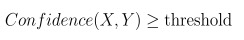

## Project 4: Query Processing, CMSC424, Spring 2018

*The assignment is to be done by yourself.*

Please do a `git pull` to download the directory `project4`. The files are:

### Getting started
Start the VM with `vagrant up` in the `project4/` directory.

**Q1 (10pt)**. [Query Plan] If you add the keyword EXPLAIN at the beginning of a query, PostgreSQL will display the execution plan for that query. This plan includes how many tuples are estimated by the query optimizer to be generated after each operation in the query plan. Furthermore, if you add the keyword ANALYZE after EXPLAIN at the beginning of a query, then in addition to getting the execution plan, the query also gets executed and also shows the actual number of tuples that were generated when the query plan was executed.

Below is a query that was sent to PostgreSQL that prints the customers who have taken a flight more than once from a source or destination which is the hub of his frequentflyer airline. 

```
explain analyze select c.customerid, count(*) as hub_flight_freq
from customers c, flewon fl, flights f, airlines a 
where c.customerid = fl.customerid 
and fl.flightid = f.flightid 
and c.frequentflieron = a.airlineid
and (a.hub = f.source or a.hub = f.dest)
group by c.customerid having count(*) > 1
order by count(*) desc, c.customerid;
```

In order to view the query plan and its execution on the query, we ran `explain analyze` on the query as shown above. The following was the query plan generated for the above query.


```
QUERY PLAN                                                                    
--------------------------------------------------------------------------------------------------------------------------------------------------
 Sort  (cost=72.55..72.56 rows=8 width=11) (actual time=0.926..0.928 rows=60 loops=1)
   Sort Key: (count(*)), c.customerid
   Sort Method: quicksort  Memory: 29kB
   ->  HashAggregate  (cost=72.33..72.42 rows=8 width=11) (actual time=0.801..0.815 rows=60 loops=1)
         Filter: (count(*) > 1)
         Rows Removed by Filter: 31
         ->  Hash Join  (cost=32.27..72.27 rows=8 width=11) (actual time=0.167..0.722 rows=198 loops=1)
               Hash Cond: (fl.flightid = f.flightid)
               Join Filter: ((a.hub = f.source) OR (a.hub = f.dest))
               Rows Removed by Join Filter: 602
               ->  Hash Join  (cost=29.46..54.47 rows=800 width=34) (actual time=0.116..0.409 rows=800 loops=1)
                     Hash Cond: (fl.customerid = c.customerid)
                     ->  Seq Scan on flewon fl  (cost=0.00..14.00 rows=800 width=18) (actual time=0.004..0.066 rows=800 loops=1)
                     ->  Hash  (cost=27.86..27.86 rows=128 width=27) (actual time=0.101..0.101 rows=128 loops=1)
                           Buckets: 1024  Batches: 1  Memory Usage: 6kB
                           ->  Hash Join  (cost=22.82..27.86 rows=128 width=27) (actual time=0.021..0.070 rows=128 loops=1)
                                 Hash Cond: (c.frequentflieron = a.airlineid)
                                 ->  Seq Scan on customers c  (cost=0.00..3.28 rows=128 width=14) (actual time=0.002..0.012 rows=128 loops=1)
                                 ->  Hash  (cost=15.70..15.70 rows=570 width=28) (actual time=0.004..0.004 rows=4 loops=1)
                                       Buckets: 1024  Batches: 1  Memory Usage: 1kB
                                       ->  Seq Scan on airlines a  (cost=0.00..15.70 rows=570 width=28) (actual time=0.003..0.003 rows=4 loops=1)
               ->  Hash  (cost=1.80..1.80 rows=80 width=15) (actual time=0.035..0.035 rows=80 loops=1)
                     Buckets: 1024  Batches: 1  Memory Usage: 4kB
                     ->  Seq Scan on flights f  (cost=0.00..1.80 rows=80 width=15) (actual time=0.005..0.016 rows=80 loops=1)
 Total runtime: 1.030 ms
```

You do not need to run the query. You just need to understand the query plan shown above.

#### Answer the following questions on ELMS

1. State True or False. For all hash joins involved in this query, the smaller of the two relations is always hashed. 
2. State True or False: The filter condition (a.hub=f.source or a.hub=f.dest) is executed after all the join operations are performed. 
3. State 1,2 or 3 (only 1 correct answer): The join operations are performed in the following order (earliest to last): 
   1. fl.flightid=f.flightid, fl.customerid = c.customerid, c.frequentflieron = a.airlineid. 
   2. c.frequentflieron = a.airlineid, fl.customerid = c.customerid, fl.flightid=f.flightid.
   3. fl.customerid = c.customerid, fl.flightid=f.flightid, c.frequentflieron = a.airlineid.
4. State 1,2 or 3 (only 1 correct answer): On which of the following join conditions does the query optimizer perform poorly in terms of overestimating or underestimating the size of the output?
   1. fl.flightid=f.flightid
   2. fl.customerid = c.customerid
   3. c.frequentflieron = a.airlineid 

**Q2 (10pt)**. [Query Debugging] For this problem, you are required to switch to `q2db` database (`psql q2db`) where we have already populated the `customers` table with a relatively large dataset. The `customers` table has the same schema as the one that we had used in Project 1. The following query counts the number of customer pairs whose year of birth differ by a year.

```
with custbyear as (
select customerid, name, extract(year from birthdate) as birthyear, frequentflieron
from customers)
select count(*)
from custbyear a, custbyear b
where b.birthyear - a.birthyear = 1;
```
This query takes around 3.5 seconds to execute in the VM. Could you rewrite the query to make it execute more efficiently.

[**Hint**: You might want to use EXPLAIN to view the query plan of the query.]

The query above is inefficient because of which of the following condition [only one correct answer]:

1. The query involves a self join.
1. The query involves a self join and also on the choice of the join algorithm by the query optimizer.
1. The choice of the join algorithm by the query optimizer.
1. There are no indexes created on the birthdate column before executing the query.
1. The query involves doing a cartesian product due to the absence of a join condition.


[**Note**: In general, query optimizers does not require users to write the most efficient query. For a given query, the query optimizer enumerates all possible query plans and chooses the most efficient plan based on some heuristic. Surprisingly in this case, the query optimizer of Postgres does not do a good job!] 

#### What to turn in:
1. Submit your efficient version of the query above in the `queries4.py` file.
1. Answer the multiple choice question in ELMS.


**Q3 (10pt).** [Functional Dependency] According to your book `X -> Y` (X functionally determines Y) if each value in X is associated precisely with only one value in Y. Your book allows multiple attributes of a relation to combine to form X and/or Y. However, for this project will only consider functional dependencies for which X and Y can correspond to only one attribute from a given relation.   


Consider the following relation *S* having two attributes X and Y. 

**Relation S**

| X | Y |
|:---:|:---:| 
| 1 | 2 | 
| 2 | 3 | 
| 2 | 3 |
| 3 | 3 |
| 4 | 18|
| 7 | 16|

From *S*, we observe that X->Y. However, *Y->X does not hold*. This is because 3 in Y has two possible values of 2 and 3 in X. 

There are two primary ways to determine the functional dependencies that exist for a database schema. One option is ask a domain expert (someone who knows the real-world domain that is being modeled by the database schema) to list them all. Unfortunately, many domain experts charge huge sums of money for their time, and other domain experts are lazy. A viable alternative is to sample existing data and try to algorithmically detect functional dependencies. (Even if you choose this approach, it is still a good idea to verify the output of the algorithm with a domain expert). We will get some experience with this alternative approach in this assignment. 

As an additional complication, many real world datasets are collected though a human manually typing the data. Such datasets are prone some amount of dirtiness in the data. For example, even though name is usually dependent on social security number or some other ID value, in some cases a name is mistyped, and will appear in a dataset alongside other instances of the ID-name pair with the name typed correctly. Take, for example, the following dataset, containing the list of MLB players who hit a home run each day:

| Date | PlayerID | PlayerName | Distance (feet)
|:---:|:---:|:---:|:---:| 
| May 1 | 46 | Yonder Alonso | 420 | 
| May 1 | 24 | Ian Happ | 425 |  
| May 2 | 46 | Yondr Alonso | 455 | 
| May 2 | 97 | Maikel Franco | 397 | 
| May 3 | 46 | Yonder Alonso | 402 | 
| May 4 | 46 | Yonder Alonso | 418 | 

Any human who sees this data set would immediately conclude that PlayerID --> PlayerName is real functional dependency, and that the third tuple, which violates the dependency is simply a typo and not an indication that the dependency doesn't exist. Datasets that are scraped from NoSQL database systems are particularly prone to this type of dirtiness. There has been several research groups (including Prof. Abadi's research group) that have attempted to detect such functional dependencies that seem to exist in a dataset, despite the potential presence of some amount of dirtiness. We will call such detected functional dependencies **fuzzy functional dependencies**. 

Consider the following relation *R* having two attributes X and Y. Let us define R(X) and R(Y) as the domain (the set of all unique values) of attribute X and Y of relation R respectively. 

**Relation R**

| X | Y |
|:---:|:---:| 
| 1 | 2 | 
| 1 | 3 | 
| 1 | 4 |
| 2 | 3 |
| 2 | 3 |
| 2 | 4 |
| 3 | 3 |
| 3 | 3 |
| 4 | 18|
| 7 | 16|


We want to check if X and Y have a fuzzy functional dependency between each other (Y is fuzzy functionally dependent on X, which we will notate as: X~->Y). 

Further, let us define R<sub>DUP</sub>, while considering X~->Y, as the relation obtained from R which removes all tuples for which the value of X only appears once across the entire dataset. Therefore, in R<sub>DUP</sub>, for each value x of R<sub>DUP</sub>(X):
	
1. x appears multiple times with the same value y from R<sub>DUP</sub>(Y): e.g. x=3 (3,3)
2. x appears multiple times with different y values from value y from R<sub>DUP</sub>(Y) : e.g. x=1 (1,2),(1,3),(1,4), x=2 (2,3),(2,3),(2,4)


For the above shown relation R, the corresponding R<sub>DUP</sub> will be as follows:

**Relation R<sub>DUP</sub>**

| X | Y |
|:---:|:---:| 
| 1 | 2 | 
| 1 | 3 | 
| 1 | 4 |
| 2 | 3 |
| 2 | 3 |
| 2 | 4 |
| 3 | 3 |
| 3 | 3 |

Observe that the unique values corresponding to R(X) do not show up in R<sub>DUP</sub>.

Let us define Cardinality(x) *for each distinct* value x of R(X) as follows,

<!---
 
--->


For Relation *R*, Cardinality(1) = ⅓ [Presence of (1,2), (1,3), (1,4)], Cardinality(2) = ½ [Presence of (2,3), (2,4)] and Cardinality(7) = 1 [Presence of (7,16)]. We consider only the **unique pairs** of the form (x,y) while defining Cardinality. Thus, Cardinality(3) = 1 [Presence of (3, 3)]. **Note that cardinality is defined on the original relation R**. 

Let us define Consistency(x) *for each distinct* value x of R<sub>DUP</sub>(x) as follows,

<!---

--->


For Relation *R<sub>DUP</sub>*, Consistency(1)=⅓ [1 occurs once each with 2, 3 and 4],  Consistency(2) = ⅔ [2 occurs once with 4 and 2 times with 3] and Consistency(3) = 2/2 [3 occurs with 3 twice]. We consider all the tuples of the form (x,y) while defining consistency. **Note that consistency is defined on the duplicate relation R<sub>DUP</sub>**.

Using the above definitions, we compute Confidence(X,Y) as follows,          

<!---

--->


We say *X has a fuzzy functional dependency on Y iff* 

<!---

--->



We set the threshold based on the application requirement. *For the purpose of this project we will deal with functional dependencies of the form X->Y*.

##### Illustrating Confidence Computation

Let us consider the earlier populated tables R and R<sub>DUP</sub> to demonstrate how confidence is computed. We use R to compute **cardinality** as follows:

Cardinality(1) = 1/3, Cardinality(2) = 1/2, Cardinality(3) = 1, Cardinality(4) = 1, Cardinality(7) = 1

Sum of confidence values = (1/3+1/2+1+1+1) <br/>
Number of unique values in R(X) = 5

Further, we use R<sub>DUP</sub> to compute **consistency** as follows: 

Consistency(1)=1/3, Consistency(2) = 2/3, Consistency(3) = 2/2 

Sum of consistency values = (1/3+2/3+1) <br/>
Number of unique values in R<sub>DUP</sub>(X) = 3
 
Confidence = (1/3+1/2+1+1+1)/5 + [1+(1/3+2/3+1)]/[1+3] = 0.766 + 0.75 = 1.516

#### Coding Details:

For this problem, we have provided you with the following files:

1. **functionaldependncy/Test.java**: Computes and prints all the pairs that have a fuzzy functional dependency on each other using jdbc.
2. **populate-fd.sql**: Loads `functionaldependency/data.csv` into `q3db` database. 

Note that `q3db` is already populated with the dataset. You can check it using: 

```
$ psql q3db
q3db=# select * from dataset;
```

#### Task:

**Fuzzy Functional Dependency**: Add your SQL query that computes the fuzzy functional dependency between two columns. More details in doQuery method in Test.java.

In order to compile and run your implementation, run the following commands (from \vagrant\),

```
$ javac -cp functionaldependency/postgresql-42.2.2.jre7.jar:. functionaldependency/Test.java 
$ java -cp functionaldependency/postgresql-42.2.2.jre7.jar:. functionaldependency/Test
```


#### Coding Restrictions:
1. Please do not modify anything else.


#### Answer the following questions on ELMS
			 
Based on your understanding of fuzzy functional dependency answer the following questions: 

1. A high cardinality score is assigned to ‘x’ in X if it occurs with different ‘y’ values in Y. (True or False)

2. A high cardinality score is assigned to ‘x’ in X if it occurs with exactly one ‘y’ value multiple times. (True or False)

3. A high consistency score is assigned to ‘x’ in X if it occurs mostly with a fixed ‘y1’ in Y and with possibly few other values in Y. (True or False)

4. The confidence equation includes two parts --- one part is focused on cardinality and the other part focused on consistency. Do we really need both parts? Let’s say that we removed the **consistency** part, and kept the **cardinality** part. The functional dependency X-->Y might incorrectly exist, (i.e. when the confidence is above threshold) if we just doubled the cardinality part (i.e. confidence = 2*cardinality part instead of having confidence = cardinality part + consistency part), but would correctly be below threshold if the original confidence equation is used (because X and Y have nothing to do with each other). Which of the following would yield in such an incorrect functional dependency?
	
	(check all that apply)

	X is:
		
	* Mostly unique (only a few repeats).
	* 	Medium number of unique values, with each value repeating approximately the same number of times.
	*  	Few number of unique values, and heavily skewed (99% of column has only one value).
	*   Non-integer values.
	* Doesn’t matter! Only Y matters.
	* Doesn’t matter! We don’t need the consistency part of the equation!

	And Y is:
	
	* Mostly unique (only a few repeats)
	* Medium number of unique values, with each value repeating approximately the same number of times
	* Few number of unique values, and heavily skewed (99% of column has only one value)
	* Non-integer values
	* Doesn’t matter! Only X matters.
	* Doesn’t matter! We don’t need the consistency part of the equation!


5. The confidence equation includes two parts --- one part is focused on cardinality and the other part focused on consistency. Do we really need both parts? Let’s say that we removed the **cardinality** part, and kept the **consistency** part. The functional dependency X-->Y might incorrectly exist, (i.e. when the confidence is above threshold) if we just doubled the consistency part (i.e. confidence = 2*consistency part instead of having confidence = cardinality part + consistency part), but would correctly be below threshold if the original confidence equation is used (because X and Y have nothing to do with each other). Which of the following would yield in such an incorrect functional dependency? 

	(check all that apply)

	X is:
	
	* Mostly unique (only a few repeats).
	* Medium number of unique values, with each value repeating approximately the same number of times.
	* Few number of unique values, and heavily skewed (99% of column has only one value).
	* Non-integer values.
	* Doesn’t matter! Only Y matters.
	* Doesn’t matter! We don’t need the consistency part of the equation!

	And Y is:
	
	* Mostly unique (only a few repeats).
	* Medium number of unique values, with each value repeating approximately the same number of times.
	* Few number of unique values, and heavily skewed (99% of column has only one value).
	* Non-integer values.
	* Doesn’t matter! Only X matters.
	* Doesn’t matter! We don’t need the consistency part of the equation!

6. Give an example of a dataset where the full confidence equation (with both parts) still incorrectly predicts a functional dependency that doesn’t really exist (X and Y have nothing to do with each other). Don’t give the actual dataset, just describe X and Y using similar types of descriptions as the options given above (e.g. X has 100 unique values, and is skewed in a certain way, etc.)  (open-ended text response question)

<!---
7. Which of the following condition yields the least confidence according to our formulation? (Only one)
	1. 	When X is a random number drawn uniformly from a medium sized domain (e.g. 100 unique values).  Y is a random number drawn from a small domain (e.g. it is a Boolean attribute with only two possible values) and is heavily skewed (90% of all rows have the same value for this attribute). 
	2. When X is a random number drawn uniformly from a domain of size equal to the number of rows in the table. In other words, X is mostly unique, but has a few repeats. Y is a random number drawn uniformly from a small domain (e.g. 2 unique values). 
	3. X is a number drawn from a domain of 20 unique values. 19 of those values only appear once in the entire dataset. Every other tuple has the 20th value of X. Y is random numbers drawn from a small domain (e.g. 2 unique values) and is heavily skewed (99.9% of all rows have the same value).
	4. X and Y are both zero for all but 30 tuples in the dataset. For those remaining 30 tuples, both X and Y can have one of 3 values, each drawn from a uniform distribution.  
	5. X and Y are both zero for all but 100 tuples in the dataset. For those remaining 100 tuples, both X and Y can have one of 10 values, but X is uniformly distributed and Y is skewed (80% of all Y values are the same). 
--->

#### What to turn in:
Please submit `Test.java` and answer the questions in ELMS.

**Q4 (10pt)**. [Sort Merge Join] In this problem, you will implement the sort merge join algorithm, more specifically the merge algorithm. The schema of the two tables to be joined and the resulting table are as follows:
``` 
CompanyLocation (cId, cLoc)
CompanyName (id, cId, cName)
ResultRelation (cId, cLoc, id, cLoc, cName)
```
The two tables (`CompanyLocation` and `CompanyName`) will be joined on the attribute `cId` which is the primary key in `CompanyLocation` and foreign key in `CompanyName`. Note that for sort merge join, we need both the tables to be sorted on the join keys. You can assume that both input tables will be sorted on the join keys. Now let us see an example below:


`CompanyLocation`

| cId | cLoc |  
|:---:|:---:| 
| 1 | NY | 
| 2 | CA | 
| 3 | OR |
| 4 | WA | 


`CompanyName`

| id | cId | cName |  
|:---:|:---:|:---:|
| 1 | 1 | IBM |
| 2 | 2 | Google |
| 4 | 2 | Facebook |
| 3 | 4 | Microsoft |


`ResultRelation`

| cId | cLoc | id | cId | cName |  
|:---:|:---:|:---:|:---:|:---:|
| 1 | NY | 1 | 1 | IBM |
| 2 | CA | 2 | 2 | Google |
| 2 | CA | 4 | 2 | Facebook |
| 4 | WA | 3 | 4 | Microsoft |

#### Coding Details:
We have provided a package `queryproc` with the following java classes:
1. **JoinOperators.java**: Your join algorithm must be written within the SortMergeJoin method. This method takes in two relations (or tables) as input (`leftRelation` and `rightRelation`) and returns the `resultRelation`.
1. **QueryProcessing.java**: Contains the main method with some helper methods for displaying the tables and testing the result.
1. **Relation.java**: The relation class with some helper methods.
1. **TupleType1.java**: Class defining the attributes for table `CompanyLoc` with helper methods.
1. **TupleType2.java**: Class defining the attributes for table `CompanyName` with helper methods.
1. **TupleType3.java**: Class defining the attributes for table `ResultRelation` with helper methods.

You may write your code with/without the help of an IDE of your choice (We encourage you to write/debug your code in an IDE). However your final code should compile and run with the following commands within the VM.

```
javac queryproc/*.java
java queryproc/QueryProcessing
```

**Assumptions**: Please note the following assumptions in regards to testing your code:
1. The join key in the `leftRelation` will always be the primary key of the `leftRelation`.
1. The join key in the `rightRelation` will always refer to the primary key of the `leftRelation`, i.e. it is a foreign key.
1. There would not be any `NULL` values in the tables provided.
1. The input tables can be assumed to have at least one tuple.
1. The input tables will be sorted on the join keys.

#### Coding Restrictions:
1. You are only allowed to **add/modify** your **own** code to the following java files: (i) **JoinOperators.java**: Put all your code within the SortMergeJoin method, (ii) **Relation.java**: If you think you need additional variables or helper methods in Relation.java, you may include them. You may also add additional code in the constructor if required, but you are not allowed to modify the constructor input parameters. 
1. For the remaining java files, please do not modify any existing code in any of those files.
1. Please remember to maintain the same order of attributes as shown in the example above when inserting a tuple in the table `ResultRelation`. More instructions provided in JoinOperators.java.

#### What to turn in:
Please submit `JoinOperators.java` and `Relation.java`.
