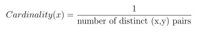
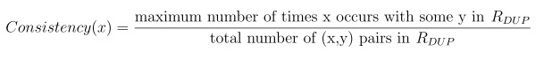
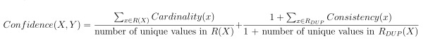

## Project 4: Query Processing, CMSC424, Spring 2018

*The assignment is to be done by yourself.*

Please do a `git pull` to download the directory `project4`. The files are:

### Getting started
Start the VM with `vagrant up` in the `project4/` directory.

**Q1 (10pt)**. [Query Plan] The EXPLAIN output on a query displays the execution plan. It also shows how many tuples are estimated by the query optimizer to be generated after each operation in the query plan. However, using EXPLAIN ANALYZE, the query gets executed and also shows the actual number of tuples generated when the query plan was executed.

We write a query that prints the customers who have taken a flight more than once from a source or destination which is the hub of his frequentflyer flight. 

```
explain analyze select c.customerid, count(*) as hub_flight_freq
from customers c, flewon fl, flights f, airlines a 
where c.customerid = fl.customerid 
and fl.flightid = f.flightid 
and c.frequentflieron = a.airlineid
and (a.hub = f.source or a.hub = f.dest)
group by c.customerid having count(*) > 1
order by count(*) desc, c.customerid;
```

In order to view the query plan and its execution on the query, we ran `explain analyze` on the query as shown above. The following was the query plan generated for the above query.


```
QUERY PLAN                                                                    
--------------------------------------------------------------------------------------------------------------------------------------------------
 Sort  (cost=72.55..72.56 rows=8 width=11) (actual time=0.926..0.928 rows=60 loops=1)
   Sort Key: (count(*)), c.customerid
   Sort Method: quicksort  Memory: 29kB
   ->  HashAggregate  (cost=72.33..72.42 rows=8 width=11) (actual time=0.801..0.815 rows=60 loops=1)
         Filter: (count(*) > 1)
         Rows Removed by Filter: 31
         ->  Hash Join  (cost=32.27..72.27 rows=8 width=11) (actual time=0.167..0.722 rows=198 loops=1)
               Hash Cond: (fl.flightid = f.flightid)
               Join Filter: ((a.hub = f.source) OR (a.hub = f.dest))
               Rows Removed by Join Filter: 602
               ->  Hash Join  (cost=29.46..54.47 rows=800 width=34) (actual time=0.116..0.409 rows=800 loops=1)
                     Hash Cond: (fl.customerid = c.customerid)
                     ->  Seq Scan on flewon fl  (cost=0.00..14.00 rows=800 width=18) (actual time=0.004..0.066 rows=800 loops=1)
                     ->  Hash  (cost=27.86..27.86 rows=128 width=27) (actual time=0.101..0.101 rows=128 loops=1)
                           Buckets: 1024  Batches: 1  Memory Usage: 6kB
                           ->  Hash Join  (cost=22.82..27.86 rows=128 width=27) (actual time=0.021..0.070 rows=128 loops=1)
                                 Hash Cond: (c.frequentflieron = a.airlineid)
                                 ->  Seq Scan on customers c  (cost=0.00..3.28 rows=128 width=14) (actual time=0.002..0.012 rows=128 loops=1)
                                 ->  Hash  (cost=15.70..15.70 rows=570 width=28) (actual time=0.004..0.004 rows=4 loops=1)
                                       Buckets: 1024  Batches: 1  Memory Usage: 1kB
                                       ->  Seq Scan on airlines a  (cost=0.00..15.70 rows=570 width=28) (actual time=0.003..0.003 rows=4 loops=1)
               ->  Hash  (cost=1.80..1.80 rows=80 width=15) (actual time=0.035..0.035 rows=80 loops=1)
                     Buckets: 1024  Batches: 1  Memory Usage: 4kB
                     ->  Seq Scan on flights f  (cost=0.00..1.80 rows=80 width=15) (actual time=0.005..0.016 rows=80 loops=1)
 Total runtime: 1.030 ms
```

You do not need to run the query; You need to understand the query plan and answer the following questions in `p4q1.txt` for each of the following questions. Please write the answer corresponding to each of the following questions in a new line in `p4q1.txt`.

1. State True or False: The first join operation is executed on the condition fl.flightid = f.flightid. 
2. State True or False: The filter condition (a.hub=f.source or a.hub=f.dest) is executed after all the join operations are performed. 
3. State 1,2 or 3 (only 1 correct answer): The join operations are performed in the following order (earliest to last): 
   1. fl.flightid=f.flightid, fl.customerid = c.customerid, c.frequentflieron = a.airlineid. 
   2. c.frequentflieron = a.airlineid, fl.customerid = c.customerid, fl.flightid=f.flightid.
   3. fl.customerid = c.customerid, fl.flightid=f.flightid, c.frequentflieron = a.airlineid.
4. State 1,2 or 3 (only 1 correct answer): On which of the following join conditions does the query optimizer perform poorly in terms of overestimating or underestimating the size of the output?
   1. fl.flightid=f.flightid
   2. fl.customerid = c.customerid
   3. c.frequentflieron = a.airlineid

#### What to turn in:
Submit `q4p1.txt` file. 

**Q2 (10pt)**. [Query Debugging] For this problem, you are required to switch to `q2db` database (`psql q2db`) where we have already populated the `customers` table with a relatively large dataset. The `customers` table has the same schema as the one that we had used in Project 1. The following query counts the number of customer pairs whose year of birth differ by a year.

```
select count(*)
from customers a, customers b
where extract(year from b.birthdate) - extract(year from a.birthdate) = 1 
and extract(year from a.birthdate) < extract(year from b.birthdate);
```
This query takes around 10 seconds to execute in the VM. Could you rewrite the query to make it execute more efficiently.

[**Note**: In general, query optimizers does not require users to write the most efficient query. For a given query, the query optimizer enumerates all possible query plans and chooses the most efficient plan based on some heuristic. Surprisingly in this case, the query optimizer of Postgres does not do a good job!] 

#### What to turn in:
Submit your efficient version of the query above in the `queries4.py` file. 


**Q3 (10pt).** [Functional Dependency] Let us consider a relation *R* having two attributes *X* and *Y*. We say `X -> Y` (X functionally determines Y) in R iff each value in X is associated precisely with only one value in Y. (Note that each X and Y can be sets of attributes). However, for this project we deal only with dependencies of the form X->Y where X and Y consist of 1 attribute each e.g. R1->R2. In essence, functional dependency determines some kind of association between two attributes or sets of attributes.  


Consider the following relation *S* having two attributes R<sub>1</sub> and R<sub>2</sub>. 

`Relation S`

| R<sub>1</sub> | R<sub>2</sub> |
|:---:|:---:| 
| 1 | 2 | 
| 2 | 3 | 
| 2 | 3 |
| 2 | 4 |
| 3 | 3 |
| 4 | 18|
| 7 | 16|

From *S*, we observe that R<sub>1</sub>->R<sub>2</sub>. However,  R<sub>2</sub>->R<sub>1</sub> does not hold. This is because 3 in R<sub>2</sub> has two possible values of 2 and 3 in R<sub>1</sub>. 

As we know that data in each of these tables could be collected from multiple sources, it could be highly prone to errors during various stages of data acquisition and processing. However, in spite of containing some errors, it could still be the case that two attributes or sets of attributes are associated with a reasonable confidence. To accommodate such cases we define the notion of **fuzzy functional dependency** for this project. 

For illustrating fuzzy functional dependency consider the following relation *P* having two attributes R<sub>1</sub> and R<sub>2</sub>. We observe that *neither* R<sub>1</sub>->R<sub>2</sub> nor R<sub>2</sub>->R<sub>1</sub> in P.

`Relation P`

| R<sub>1</sub> | R<sub>2</sub> |
|:---:|:---:| 
| 1 | 2 | 
| 1 | 3 | 
| 1 | 4 |
| 2 | 3 |
| 2 | 3 |
| 2 | 4 |
| 3 | 3 |
| 3 | 3 |
| 4 | 18|
| 7 | 16|


Let a’s and b’s be the set of values corresponding to attributes R<sub>1</sub> and R<sub>2</sub> of relation P respectively. Let us define Cardinality(a) *for each distinct* value a of attribute R<sub>1</sub> as follows,

<!---
 
--->


For Relation *P*, Cardinality(1) = ⅓ [Presence of (1,2), (1,3), (1,4)], Cardinality(2) = ½ [Presence of (2,3), (2,4)] and Cardinality(7) = 1 [Presence of (7,16)]. We consider only the unique pairs of the form (a,b) while defining Cardinality. Let us define Consistency(a) *for each distinct* value a of attribute R<sub>1</sub> as follows,
<!---

--->


For Relation *P*, Consistency(1)=⅓ [1 occurs once each with 2, 3 and 4],  Consistency(2) = ⅔ [2 occurs once with 4 and 2 times with 3] and Consistency(3) = 2/2 [3 occurs with 3 twice]. We consider all the tuples of the form (a,b) while defining Consistency. Further, let us define Rep(a) as follows,
<!---

--->



For Relation *P*, Rep(1)=0, Rep(2)=0 and Rep(3)=2 [3 occurs 2 times with 3]. Using the above definitions, we compute Confidence(R<sub>1</sub>->R<sub>2</sub>) as follows,          
<!---

--->


We say *R<sub>1</sub> has a fuzzy functional dependency R<sub>2</sub> iff* 

<!---

--->


We set the threshold based on the application requirement. *For the purpose of this project we will deal with functional dependencies of the form X->Y*.

#### Coding Details:

We have provided you with a package `functionaldependency` with the following files (inside src directory):

1. **src/Table.java**: Loads the table with the data from the input file.
2. **src/Dependency.java**: Enumerates all pairs of possible columns to check for a possible functional dependency or fuzzy functional dependency.
3. **src/CheckFD.java**: You will be implementing methods that check for functional dependency and fuzzy functional dependency.
4. **src/Run.java**: Prints the output corresponding to your implementation of the two methods on `data.csv`.
5. **src/Test.java**: Prints the output corresponding to your implementation of the two methods on `test.csv`. You can cross check the output with a predefined loaded expected output on `test.csv`.
6. **test.csv**: A small table where you could test your implementation.
7. **data.csv**: Actual file on which *we would be testing your implementation*. 

#### Coding Restrictions:
1. You are only allowed to **add/modify** your **own** code to **src/CheckFD.java**. You can add any helper functions under **src/CheckFD.java**. Please do not modify anything else. This will create a problem when we test your implementation as you will be turning in only CheckFD.java. There are specific instructions in src/CheckFD.java.
2. We provide you a Makefile for making it easy for you. After performing `cd functionaldependency`, you can use the following commands associated to the make file. 
   1. `make clean`: Removes the current .class files.
   2. `make test`: Compiles and runs the code against *test.csv*.
   3. `make run`: Compiles and runs the code against *data.csv*.  			 

#### Tasks:
1. **Functional Dependency**: Implement the checkDependency method inside src/CheckFD.java.
2. **Fuzzy Functional Dependency**: Implement the checkFuzzyDependency method inside src/CheckFD.java.


Based on your implementation and understanding of fuzzy functional dependency answer the following questions in `p4q3.txt` (create it). Consider that we have `Relation Z` shown below having two attributes `X` and `Y`, dependency X->Y where x and y are values of X and Y respectively. *Please make sure to enter the answers corresponding to each of the questions in a separate line.*

`Relation Z`

| X | Y |
|:---:|:---:| 
| 1 | 2 | 
| 1 | 3 | 
| 1 | 4 |
| 2 | 3 |
| 2 | 3 |
| 3 | 3 |
| 3 | 3 |
| 4 | 18|
| 7 | 16|

State true or false. 	
 
 1. Cardinality(1) > Cardinality(7). 
 2. Consistency(3) > Consistency(2).
 3. Rep(2) = Rep(3).


#### What to turn in:
Please submit `CheckFD.java` and `p4q3.txt`.

**Q4 (10pt)**. [Sort Merge Join] In this problem, you will implement the sort merge join algorithm, more specifically the merge algorithm. The schema of the two tables to be joined and the resulting table are as follows:
``` 
CompanyLocation (cId, cLoc)
CompanyName (id, cId, cName)
ResultRelation (cId, cLoc, id, cLoc, cName)
```
The two tables (`CompanyLocation` and `CompanyName`) will be joined on the attribute `cId` which is the primary key in `CompanyLocation` and foreign key in `CompanyName`. Note that for sort merge join, we need both the tables to be sorted on the join keys. You can assume that both input tables will be sorted on the join keys. Now let us see an example below:


`CompanyLocation`

| cId | cLoc |  
|:---:|:---:| 
| 1 | NY | 
| 2 | CA | 
| 3 | OR |
| 4 | WA | 


`CompanyName`

| id | cId | cName |  
|:---:|:---:|:---:|
| 1 | 1 | IBM |
| 2 | 2 | Google |
| 4 | 2 | Facebook |
| 3 | 4 | Microsoft |


`ResultRelation`

| cId | cLoc | id | cId | cName |  
|:---:|:---:|:---:|:---:|:---:|
| 1 | NY | 1 | 1 | IBM |
| 2 | CA | 2 | 2 | Google |
| 2 | CA | 4 | 2 | Facebook |
| 4 | WA | 3 | 4 | Microsoft |

#### Coding Details:
We have provided a package `queryproc` with the following java classes:
1. **JoinOperators.java**: Your join algorithm must be written within the SortMergeJoin method. This method takes in two relations (or tables) as input (`leftRelation` and `rightRelation`) and returns the `resultRelation`.
1. **QueryProcessing.java**: Contains the main method with some helper methods for displaying the tables and testing the result.
1. **Relation.java**: The relation class with some helper methods.
1. **TupleType1.java**: Class defining the attributes for table `CompanyLoc` with helper methods.
1. **TupleType2.java**: Class defining the attributes for table `CompanyName` with helper methods.
1. **TupleType3.java**: Class defining the attributes for table `ResultRelation` with helper methods.

You may write your code with/without the help of an IDE of your choice (We encourage you to write/debug your code in an IDE). However your final code should compile and run with the following commands within the VM.
```
javac queryproc/*.java
java queryproc/QueryProcessing
```

**Assumptions**: Please note the following assumptions in regards to testing your code:
1. The join key in the `leftRelation` will always be the primary key of the `leftRelation`.
1. The join key in the `rightRelation` will always refer to the primary key of the `leftRelation`, i.e. it is a foreign key.
1. There would not be any `NULL` values in the tables provided.
1. The input tables can be assumed to have at least one tuple.
1. The input tables will be sorted on the join keys.

#### Coding Restrictions:
1. You are only allowed to **add/modify** your **own** code to the following java files: (i) **JoinOperators.java**: Put all your code within the SortMergeJoin method, (ii) **Relation.java**: If you think you need additional variables or helper methods in Relation.java, you may include them. You may also add additional code in the constructor if required, but you are not allowed to modify the constructor input parameters. 
1. For the remaining java files, please do not modify any existing code in any of those files.
1. Please remember to maintain the same order of attributes as shown in the example above when inserting a tuple in the table `ResultRelation`. More instructions provided in JoinOperators.java.

#### What to turn in:
Please submit `JoinOperators.java` and `Relation.java`.
